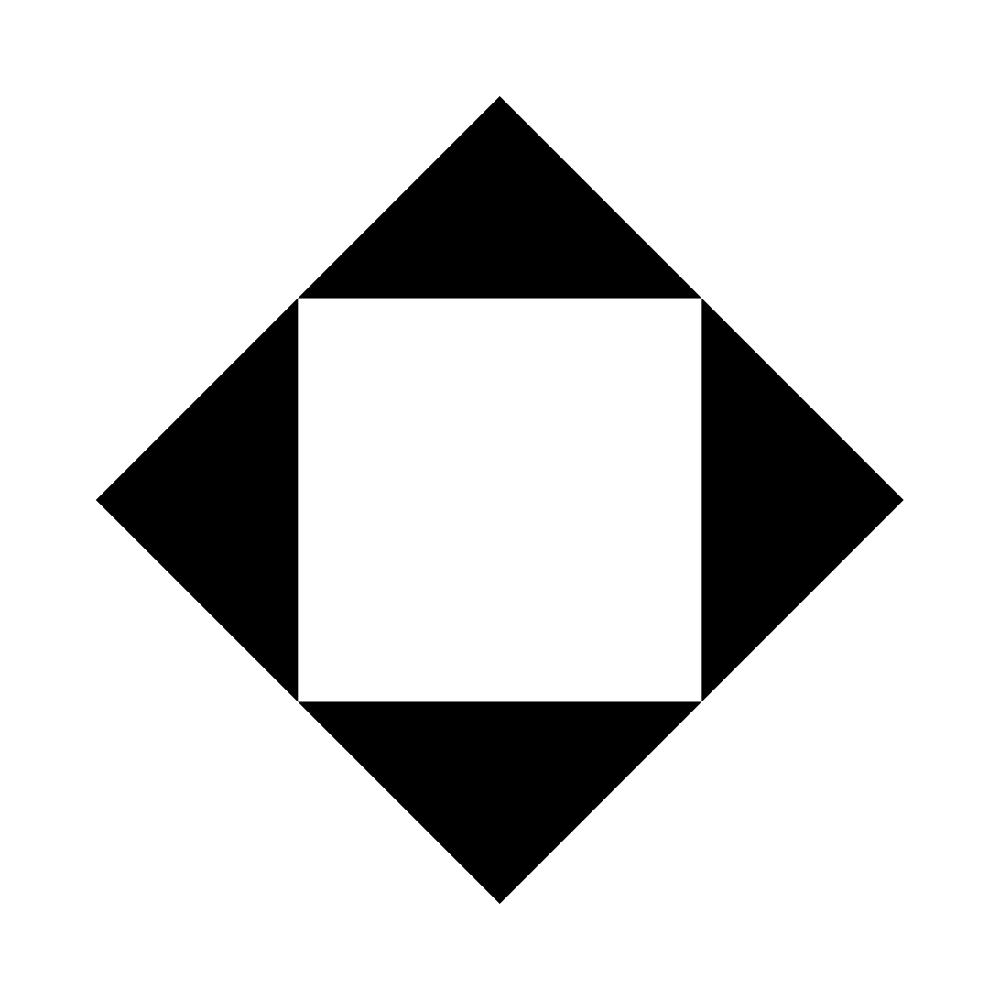
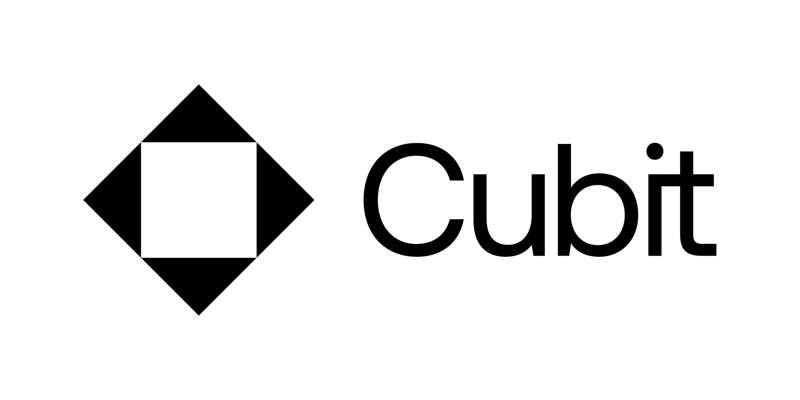
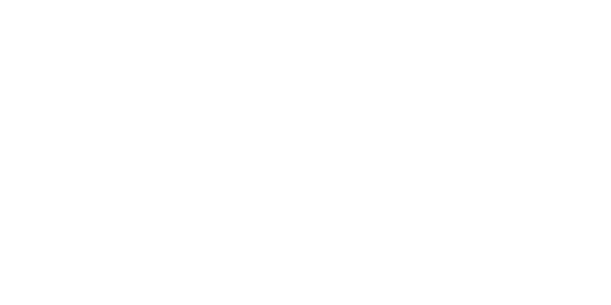
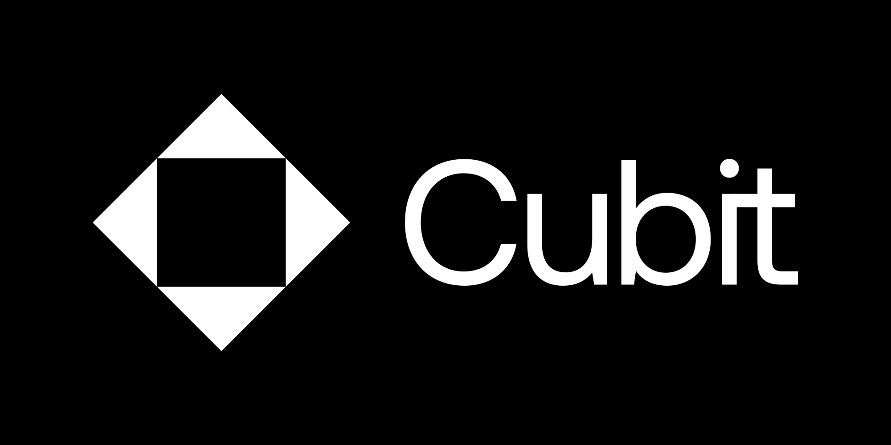
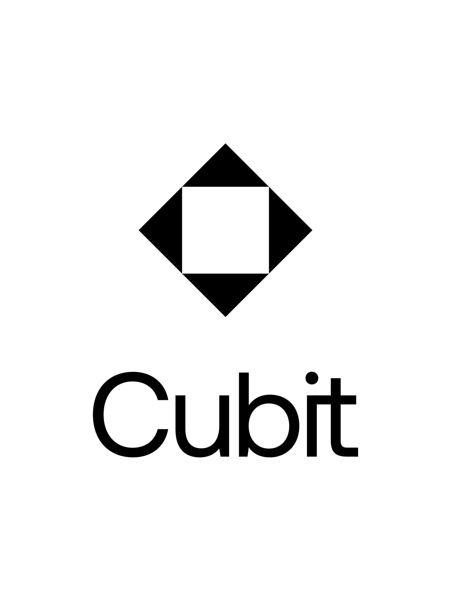
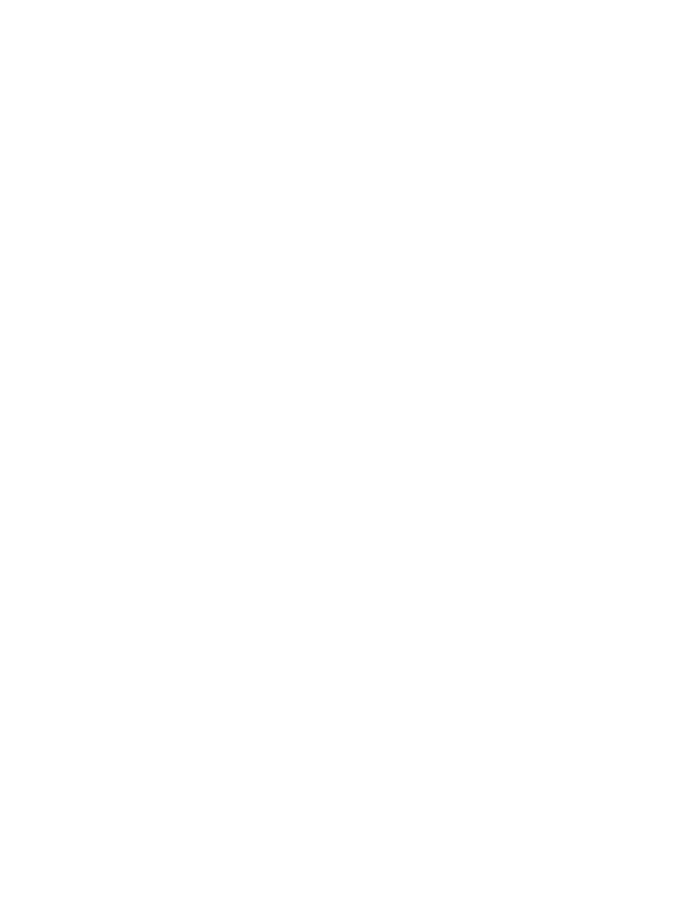
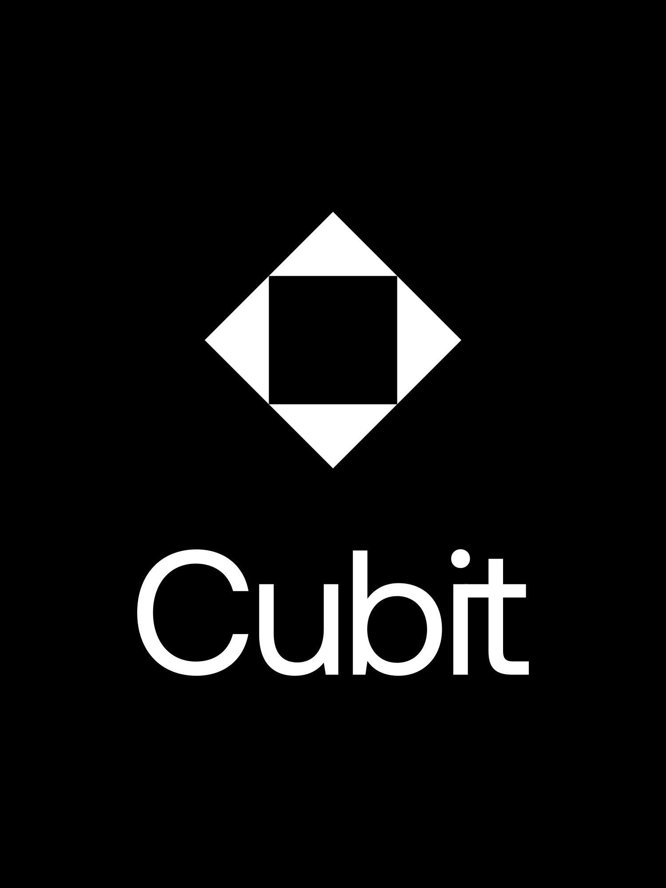

# cubit-brand
Assets exported from this [figma file](https://www.figma.com/file/AhzE5IpN66oywIUQOBjTXl/Cubit-Logo-(draft)?node-id=0%3A1&t=EI4d5JMxLYEMYoPZ-1)

| File Name |Image      |
|:-:|:-: |
|logo-dark.svg|   |
|logo-dark_bkg.svg | |
|logo-horz-dark.svg||
|logo-horz-dark_bkg.svg||
|logo-horz-light.svg||
|logo-horz-light_bkg.svg||
|logo-light.svg||
|logo-light_bkg.svg||
|logo-vert-dark.svg||
|logo-vert-dark_bkg.svg||
|logo-vert-light.svg||
|logo-vert-light_bkg.svg||